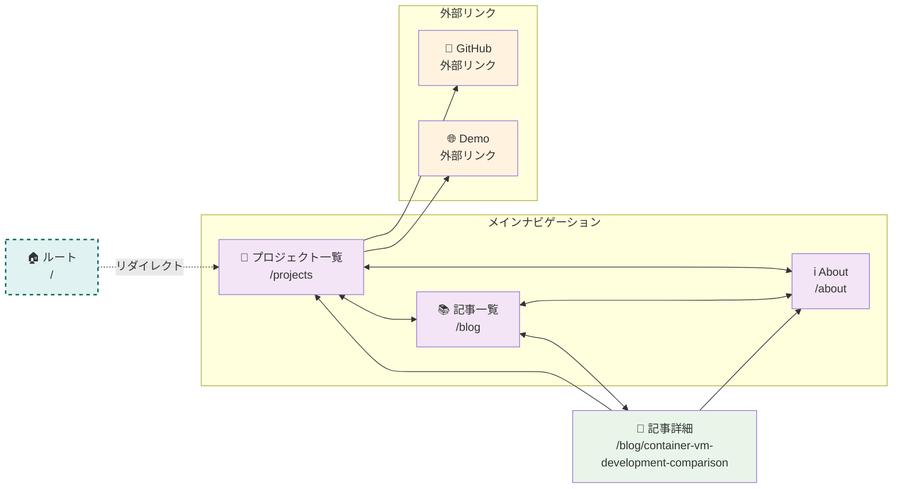
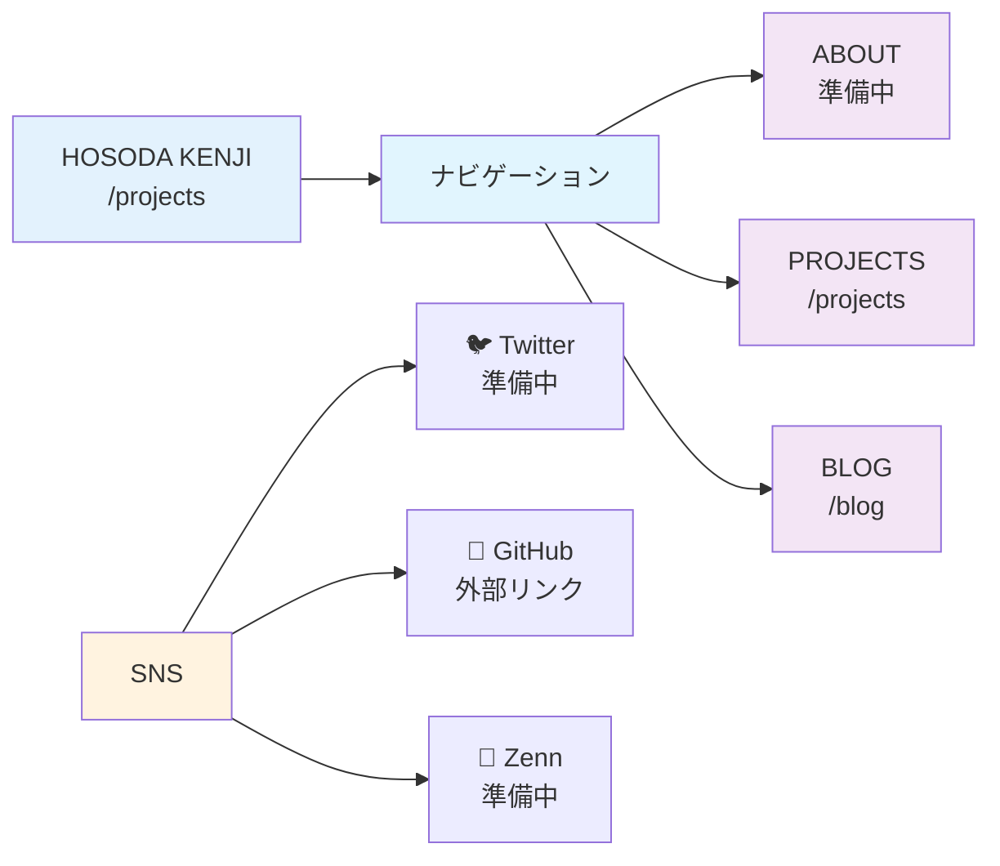

# Kenji Hub - ナビゲーション概要

## 基本的なページ遷移

## ナビゲーションメニュー（全ページ共通）

## 現在のページ一覧

| ページ | URL | 説明 |
|--------|-----|------|
| 🏠 ルート | `/` | `/projects`にリダイレクト |
| 💼 プロジェクト一覧 | `/projects` | メインページ（プロジェクト一覧と自己紹介） |
| 📚 記事一覧 | `/blog` | ブログ記事の一覧 |
| 📄 記事詳細 | `/blog/container-vm-development-comparison` | Container VM比較記事 |
| ℹ️ About | `/about` | 準備中（現在は無効） |

## 外部リンク

| リンク | URL | 説明 |
|--------|-----|------|
| 🐦 Twitter | `https://twitter.com/your_twitter` | 準備中 |
| 🐙 GitHub | `https://github.com/kmh-no3` | GitHubアカウント |
| 📝 Zenn | `https://zenn.dev/your_zenn` | 準備中 |
| 🔐 PWA Demo | `https://kmh-no3.github.io/pwa-password-generator` | パスワードジェネレーター |
| 🐙 Container VM | `https://github.com/kmh-no3/Container_VM` | Container VM比較リポジトリ |

## ロゴリンクの動作

各ページでの「HOSODA KENJI」ロゴのリンク先：

| ページ | ロゴリンク先 | 説明 |
|--------|-------------|------|
| 🏠 ルート (`/`) | `/projects` | プロジェクト一覧ページへ（リダイレクト後） |
| 💼 プロジェクト一覧 (`/projects`) | `/projects` | 自己参照（現在ページ） |
| 📚 記事一覧 (`/blog`) | `/projects` | プロジェクト一覧ページへ |
| 📄 記事詳細 (`/blog/[id]`) | `/projects` | プロジェクト一覧ページへ |

## ナビゲーション構造の特徴

- **全ページ共通ヘッダー**: 全てのページで同じナビゲーションメニューが表示される
- **双方向遷移**: どのページからでも他のページに遷移可能
- **メインページ**: `/projects`が実質的なメインページ
- **準備中ページ**: ABOUTページは現在準備中（無効）
- **外部リンク**: プロジェクトページからGitHubやDemoへの外部リンク
