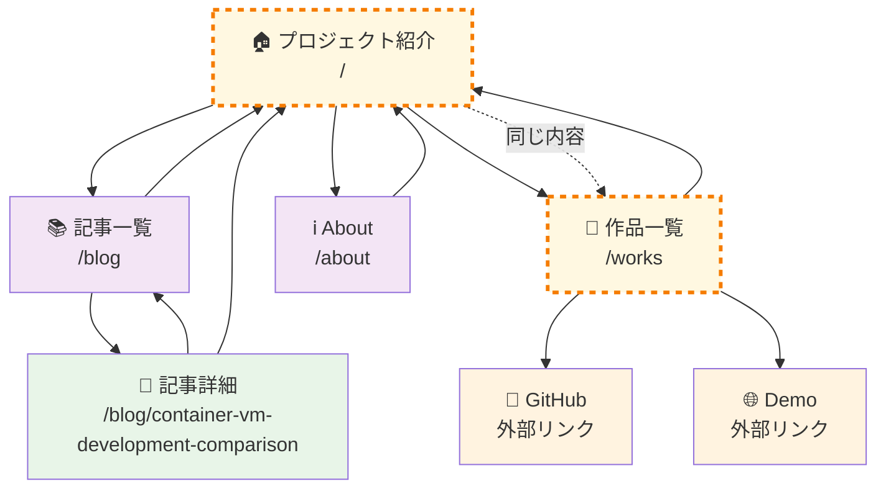
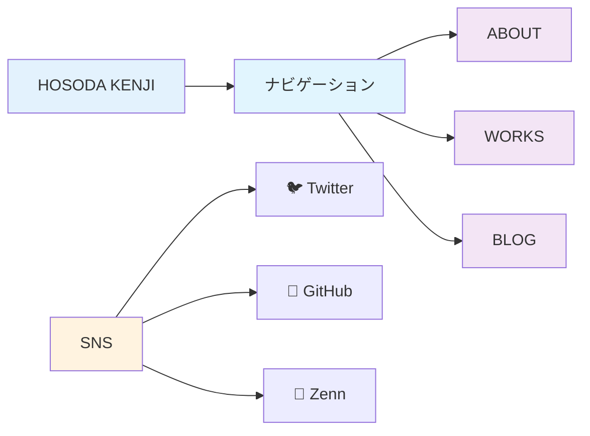

# Kenji Hub - シンプルページ遷移図

## 基本的なページ遷移

## ナビゲーションメニュー

## 現在のページ一覧

| ページ | URL | 説明 |
|--------|-----|------|
| 🏠 プロジェクト紹介 | `/` | メインページ、プロジェクト紹介（作品一覧と同じ内容） |
| 📚 記事一覧 | `/blog` | ブログ記事の一覧 |
| 📄 記事詳細 | `/blog/container-vm-development-comparison` | Container VM比較記事 |
| 💼 作品一覧 | `/works` | プロジェクト作品の一覧（ルートページと同じ内容） |
| ℹ️ About | `/about` | 自己紹介ページ |

## 外部リンク

| リンク | URL | 説明 |
|--------|-----|------|
| 🐦 Twitter | `https://twitter.com/your_twitter` | Twitterアカウント |
| 🐙 GitHub | `https://github.com/your_github` | GitHubアカウント |
| 📝 Zenn | `https://zenn.dev/your_zenn` | Zennアカウント |
| 🔐 PWA Demo | `https://kmh-no3.github.io/pwa-password-generator` | パスワードジェネレーター |
| 🐙 Container VM | `https://github.com/kmh-no3/Container_VM` | Container VM比較リポジトリ |

## ロゴリンクの動作

各ページでの「HOSODA KENJI」ロゴのリンク先：

| ページ | ロゴリンク先 | 説明 |
|--------|-------------|------|
| 🏠 プロジェクト紹介 (`/`) | `/works` | 作品一覧ページへ（同じ内容） |
| 💼 作品一覧 (`/works`) | `/works` | 自己参照（現在ページ） |
| 📚 記事一覧 (`/blog`) | `/blog` | 自己参照（現在ページ） |
| 📄 記事詳細 (`/blog/[id]`) | `/blog` | 記事一覧ページへ |

## 同じ内容のページ

| ページ1 | ページ2 | 関係 |
|---------|---------|------|
| 🏠 プロジェクト紹介 (`/`) | 💼 作品一覧 (`/works`) | **同じ内容** |
