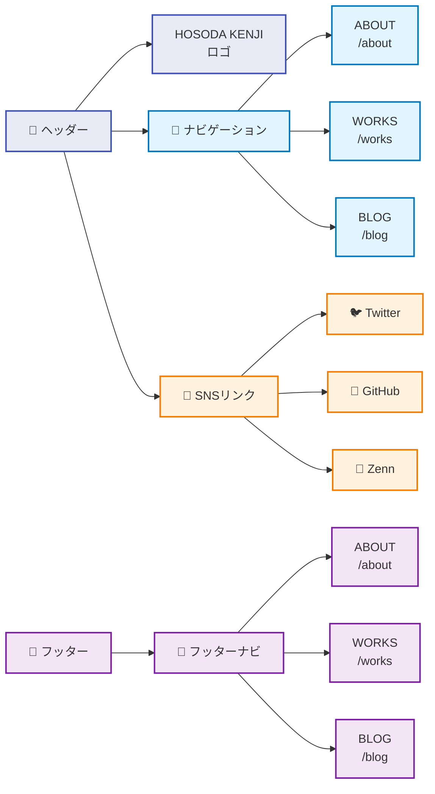
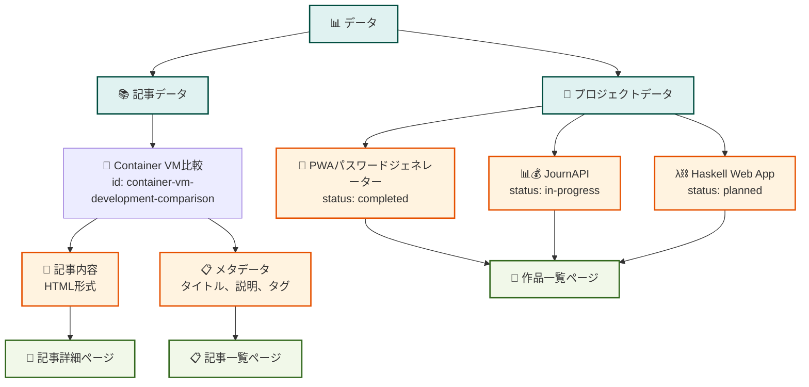
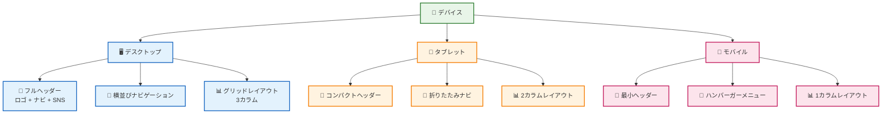
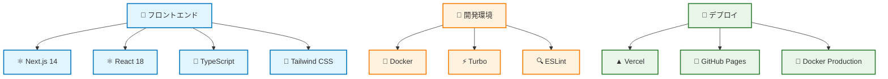

# Kenji Hub - ページ遷移図

## サイト全体のページ遷移フロー

```mermaid
graph TD
    %% メインページ（同じ内容）
    A[🏠 プロジェクト紹介<br/>/] --> B[📚 記事一覧<br/>/blog]
    A --> C[💼 作品一覧<br/>/works]
    A --> D[ℹ️ About<br/>/about]
    
    %% 同じ内容のページを強調
    C -.->|同じ内容| A
    
    %% 記事関連
    B --> E[📄 記事詳細<br/>/blog/[id]]
    E --> B
    E --> A
    
    %% 作品関連
    C --> F[🔗 GitHub<br/>外部リンク]
    C --> G[🌐 Demo<br/>外部リンク]
    
    %% ナビゲーション
    B --> A
    B --> C
    B --> D
    C --> A
    C --> B
    C --> D
    E --> A
    E --> B
    E --> C
    E --> D
    
    %% 外部リンク
    A --> H[🐦 Twitter<br/>外部リンク]
    A --> I[🐙 GitHub<br/>外部リンク]
    A --> J[📝 Zenn<br/>外部リンク]
    
    %% スタイル設定
    classDef mainPage fill:#e1f5fe,stroke:#01579b,stroke-width:2px
    classDef subPage fill:#f3e5f5,stroke:#4a148c,stroke-width:2px
    classDef externalLink fill:#fff3e0,stroke:#e65100,stroke-width:2px
    classDef dynamicPage fill:#e8f5e8,stroke:#1b5e20,stroke-width:2px
    classDef sameContent fill:#fff8e1,stroke:#f57c00,stroke-width:3px,stroke-dasharray: 5 5
    
    class A,C sameContent
    class B,D subPage
    class E dynamicPage
    class F,G,H,I,J externalLink
```

## 詳細なページ構造

```mermaid
graph TD
    %% ルート構造
    Root[🌐 Kenji Hub] --> Home[🏠 プロジェクト紹介<br/>/]
    Root --> Articles[📚 記事セクション<br/>/blog]
    Root --> Works[💼 作品セクション<br/>/works]
    Root --> About[ℹ️ About<br/>/about]
    
    %% 同じ内容のページを強調
    Home -.->|同じ内容| Works
    
    %% 記事セクション詳細
    Articles --> ArticleList[📋 記事一覧<br/>/blog]
    Articles --> ArticleDetail[📄 記事詳細<br/>/blog/[id]]
    
    %% 記事詳細の内容
    ArticleDetail --> ContainerVM[🐳 Container VM比較<br/>/blog/container-vm-development-comparison]
    
    %% 作品セクション詳細
    Works --> WorksList[📋 作品一覧<br/>/works]
    Works --> Project1[🔐 PWAパスワードジェネレーター<br/>完了]
    Works --> Project2[📊💰 JournAPI<br/>開発中]
    Works --> Project3[λ⛓️ Haskell Web App<br/>計画中]
    
    %% 外部リンク
    Project1 --> Demo1[🌐 Demo<br/>https://kmh-no3.github.io/pwa-password-generator]
    Project1 --> GitHub1[🐙 GitHub<br/>https://github.com/kmh-no3/pwa-password-generator]
    Project2 --> GitHub2[🐙 GitHub<br/>https://github.com/kmh-no3/journAPI]
    Project3 --> GitHub3[🐙 GitHub<br/>https://github.com/kmh-no3/haskell-web-app]
    ContainerVM --> GitHub4[🐙 GitHub<br/>https://github.com/kmh-no3/Container_VM]
    
    %% スタイル設定
    classDef root fill:#e3f2fd,stroke:#1565c0,stroke-width:3px
    classDef page fill:#f1f8e9,stroke:#33691e,stroke-width:2px
    classDef article fill:#fff3e0,stroke:#e65100,stroke-width:2px
    classDef project fill:#fce4ec,stroke:#880e4f,stroke-width:2px
    classDef external fill:#e0f2f1,stroke:#004d40,stroke-width:2px
    classDef sameContent fill:#fff8e1,stroke:#f57c00,stroke-width:3px,stroke-dasharray: 5 5
    
    class Root root
    class Home,Works sameContent
    class About page
    class ArticleList,ArticleDetail,ContainerVM article
    class WorksList,Project1,Project2,Project3 project
    class Demo1,GitHub1,GitHub2,GitHub3,GitHub4 external
```

## ナビゲーション構造



## データフロー



## レスポンシブ対応



## ロゴリンクの動作

```mermaid
graph TD
    %% 各ページでのロゴリンク先
    RootPage[🏠 ルートページ<br/>/] --> LogoLink1[HOSODA KENJI<br/>→ /works]
    WorksPage[💼 作品ページ<br/>/works] --> LogoLink2[HOSODA KENJI<br/>→ /works]
    BlogPage[📚 ブログページ<br/>/blog] --> LogoLink3[HOSODA KENJI<br/>→ /blog]
    BlogDetailPage[📄 記事詳細<br/>/blog/[id]] --> LogoLink4[HOSODA KENJI<br/>→ /blog]
    
    %% 同じ内容のページを強調
    RootPage -.->|同じ内容| WorksPage
    
    %% スタイル設定
    classDef page fill:#e1f5fe,stroke:#0277bd,stroke-width:2px
    classDef logo fill:#fff3e0,stroke:#f57c00,stroke-width:2px
    classDef sameContent fill:#fff8e1,stroke:#f57c00,stroke-width:3px,stroke-dasharray: 5 5
    
    class RootPage,WorksPage sameContent
    class BlogPage,BlogDetailPage page
    class LogoLink1,LogoLink2,LogoLink3,LogoLink4 logo
```

## 技術スタック


